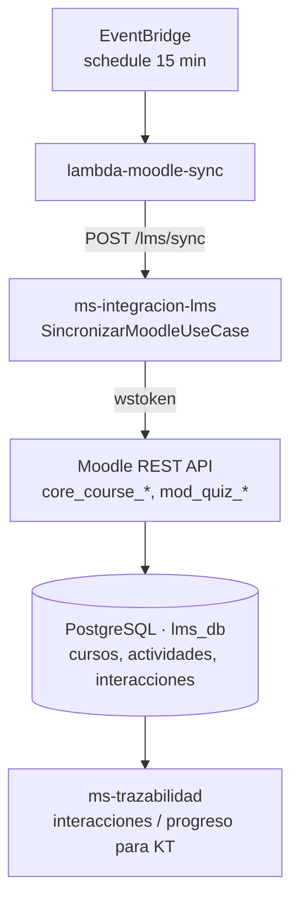
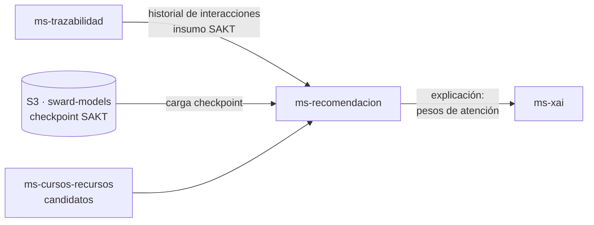
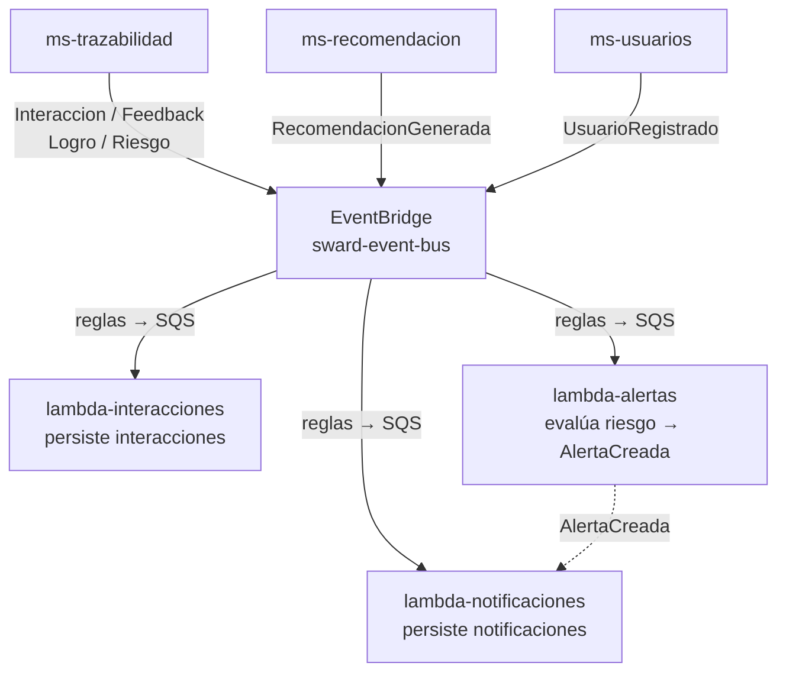

# Arquitectura de SWARD

SWARD es un conjunto de **microservicios hexagonales (puertos y adaptadores) + DDD**, comunicados
de forma **event-driven** sobre AWS. Cada microservicio corre como servicio **ECS Fargate**, tiene
su **propia base de datos PostgreSQL (RDS)** y publica/consume **eventos de dominio** a través de
**Amazon EventBridge** (`sward-event-bus`). El procesamiento asíncrono se delega a **funciones
Lambda**. El frontend es una SPA de **React** (GitHub Pages) que entra por **CloudFront + ALB**.

:::info Patrón hexagonal común
La estructura `domains / application / ports / infrastructure / routers`, la regla de
dependencias hacia adentro y los eventos emitidos por el *aggregate* y publicados por la capa
de aplicación están descritos en detalle en el documento `HEXAGONAL.md` del repositorio de
convenciones. Aquí se describe **qué hace cada servicio** y **cómo fluyen los datos entre ellos**.
:::

---

## 1. Microservicios (ECS Fargate)

Son **6**. Cada uno es un proceso FastAPI independiente con su propia BD.

### 1.1 `ms-usuarios`
Identidad y acceso de la plataforma.
- **Autenticación JWT** (login, emisión y validación de tokens).
- **Registro *gated* por Moodle**: un usuario solo se registra si existe y se valida contra Moodle;
  el **rol** (estudiante / docente) lo determina Moodle, no el formulario. El caso de uso de registro
  depende de un puerto `LmsClientPort` que consulta a `ms-integracion-lms`.
- **Roles y administración** (seed de admin inicial).
- **Notificaciones** al estudiante (p. ej. retroalimentación enviada por el docente): expone API de
  notificaciones que el frontend consume.
- BD: usuarios, roles, notificaciones.

### 1.2 `ms-integracion-lms`
Puente con Moodle.
- **Sincroniza Moodle**: cursos, actividades, calificaciones e interacciones académicas vía la
  **REST API de Moodle** (`core_course_*`, `mod_quiz_*`, ...), autenticando con `wstoken`.
- Expone esos datos al resto de SWARD (lo consume `ms-usuarios` para validar identidad en el registro
  y `ms-trazabilidad`/lambdas para alimentar el knowledge tracing).
- Caso de uso central: `SincronizarMoodleUseCase`.
- BD: `lms_db` (cursos, actividades, interacciones).

### 1.3 `ms-cursos-recursos`
Catálogo de contenido recomendable.
- Mantiene el **catálogo de cursos y recursos** (lecturas, videos, ejercicios).
- Provee los **candidatos a recomendar** que consume `ms-recomendacion`.
- BD: cursos y recursos.

### 1.4 `ms-trazabilidad`
Memoria del comportamiento del estudiante y panel docente.
- Registra **interacciones**, **progreso** y los **datos de knowledge tracing** (secuencias
  `(concepto, acierto)` por estudiante) que alimentan a SAKT.
- Provee el **dashboard docente**: desempeño, engagement, tendencia, alertas, generación de PDF y
  retroalimentación docente→estudiante.
- Publica eventos de dominio (interacción, feedback, logro, riesgo) en EventBridge.
- BD: interacciones y progreso.

### 1.5 `ms-recomendacion`
Motor de recomendación adaptativa (servicio de IA).
- Carga el **modelo SAKT** (entrenado con **pyKT**) desde su **checkpoint en S3** (`sward-models`).
- Toma el **historial de interacciones** desde `ms-trazabilidad` como insumo del modelo.
- Estima dominio de conceptos y **recomienda el siguiente recurso por formato** (entre los candidatos
  de `ms-cursos-recursos`).
- Genera **material complementario con LLM/Bedrock** cuando aplica.
- Publica `RecomendacionGenerada` y consulta a `ms-xai` para adjuntar la explicación.
- Stack: Python / pyKT (ECS). BD: recomendaciones.

### 1.6 `ms-xai`
Explicabilidad y riesgo (servicio de IA).
- **Explica las predicciones** del SAKT exponiendo los **pesos de atención** del modelo (por qué se
  recomienda X, qué conceptos pesaron).
- Evalúa y registra **alertas de riesgo** explicables sobre estudiantes.
- Stack: Python (ECS). BD: explicaciones y alertas.

---

## 2. Lambdas

Cinco funciones Lambda absorben el trabajo asíncrono y la ingesta programada:

| Lambda | Tipo | Responsabilidad |
|--------|------|-----------------|
| `lambda-moodle-sync` | Ingesta | **Programada cada 15 min** (regla *schedule* de EventBridge). Dispara la ingesta académica llamando a `ms-integracion-lms` (`POST /lms/sync`). |
| `lambda-interacciones` | Ingesta | Persiste de forma asíncrona las interacciones académicas que llegan por EventBridge → SQS. |
| `lambda-alertas` | Event-driven | Evalúa riesgo/recomendación y crea **alertas explicables**; reemite `AlertaCreada`. |
| `lambda-notificaciones` | Event-driven | Consume eventos (feedback, logros, alertas, registro) y **persiste notificaciones** para el estudiante. |
| `lambda-recursos` | Event-driven | Procesa eventos relacionados con recursos/catálogo. |

> Las lambdas se despliegan como imágenes en **ECR**; los microservicios ECS se despliegan desde
> imágenes en **GHCR**.

---

## 3. Plataforma compartida (AWS)

| Componente | Servicio AWS | Rol |
|------------|--------------|-----|
| Bus de eventos | **EventBridge** (`sward-event-bus`) | Publicación y ruteo de eventos de dominio a lambdas (vía reglas → SQS). |
| Bases de datos | **RDS PostgreSQL** | **Una BD por microservicio**. En *dev* es una sola instancia RDS compartida (`sward`). |
| Cache | **Redis** | Cache de aplicación. |
| Almacenamiento de modelos | **S3** (`sward-models`) | **Checkpoint del SAKT** y recursos. |
| Entrada / CDN | **CloudFront + ALB** | Punto de entrada HTTPS; ruteo por path a cada microservicio. |
| Frontend | **React** | SPA de estudiantes y docentes, desplegada en **GitHub Pages**. |
| LMS externo | **Moodle** | Fuente de verdad académica (cursos, notas, interacciones). |

La infraestructura se define con **AWS CDK** (repo `sward-infra`, varios stacks). El encendido /
apagado para ahorro de costos se opera con workflows de GitHub Actions
(ver [Operaciones](operaciones.md)).

---

## 4. Los tres flujos del sistema

### Flujo 1 — Ingesta Moodle → SWARD
Trae los datos académicos reales desde Moodle hacia el núcleo de SWARD.

La lambda se dispara cada 15 minutos, gatilla la sincronización en `ms-integracion-lms`, este extrae
de Moodle vía REST, persiste en su BD y los datos quedan disponibles para `ms-trazabilidad`, que
construye las secuencias de knowledge tracing.

### Flujo 2 — Knowledge tracing (recomendación explicable)
Convierte el historial del estudiante en una recomendación justificada.

`ms-recomendacion` lee el historial de `ms-trazabilidad`, carga el modelo SAKT desde S3, selecciona
el mejor recurso por formato entre los candidatos de `ms-cursos-recursos`, y pide a `ms-xai` la
explicación (pesos de atención) para acompañar la recomendación y, en su caso, las alertas de riesgo.

### Flujo 3 — Event-driven (asíncrono)
Desacopla efectos secundarios (persistencia de interacciones, alertas, notificaciones).

Los servicios publican eventos de dominio en EventBridge; las **reglas** los enrutan (normalmente a
través de **SQS**) hacia las lambdas, que ejecutan el trabajo asíncrono. `lambda-alertas` reemite
`AlertaCreada`, que a su vez puede disparar `lambda-notificaciones`.

---

## 5. Vista C4 (contenedores)

El diagrama C4 reducido (Structurizr) que resume estos tres ejes está en
[`SWARD_C4_componentes_shortpaper.dsl`](pathname:///diagramas/SWARD_C4_componentes_shortpaper.dsl).
Las instrucciones de render y el resto de figuras del proyecto están en la
sección [Diagramas](diagramas.md).

> **Estado del código (verificado):** el pipeline funciona end-to-end con **datos reales**. La ingesta
> trae cursos, actividades, **notas e interacciones** de Moodle; el SAKT corre en modo **real** (en ECS
> `ENVIRONMENT=production`, no mock) cargando el checkpoint desde S3. Verificado: reentrenamiento sobre
> **4088 interacciones reales, 69 conceptos, AUC ~0.92** (CV 5-fold; el modelo en vivo se recargó).
> El modo *mock* solo aplica al correr LOCAL (default `ENVIRONMENT=development`), no en el despliegue.
