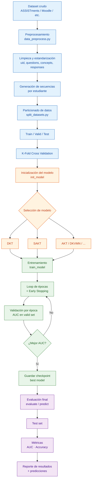
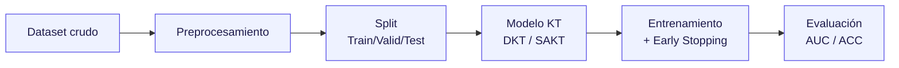

# Diagramas — DKT y pyKT

> Documento de apoyo para el paper/tesis SWARD.
> Los diagramas Mermaid se renderizan en GitHub, Notion, VS Code (extensión *Markdown Preview Mermaid*) o en https://mermaid.live para exportarlos como PNG/SVG.

---

## 1. Pseudocódigo del DKT (Deep Knowledge Tracing)

El **DKT** (Piech et al., 2015) modela el conocimiento del estudiante como el estado oculto de una
red recurrente (LSTM). En cada paso recibe la interacción `(ejercicio, acierto)` y predice la
probabilidad de acertar **cada** habilidad en el siguiente paso.

### Notación

| Símbolo | Significado |
|---------|-------------|
| `q_t`   | habilidad/ejercicio (skill) respondido en el paso `t` |
| `a_t`   | resultado binario: `1` = correcto, `0` = incorrecto |
| `x_t`   | entrada codificada de la interacción `(q_t, a_t)` |
| `M`     | número total de habilidades (skills) |
| `h_t`   | estado oculto del LSTM (representación del conocimiento) |
| `y_t`   | vector de probabilidades de acierto, una por habilidad |

### Codificación de la entrada

Cada interacción `(q_t, a_t)` se codifica como un vector one-hot de tamaño `2M`:

```
x_t = one_hot(q_t + a_t * M)   ∈ {0,1}^{2M}
```

- Si la respuesta fue **correcta**, se activa la posición `q_t + M`.
- Si fue **incorrecta**, se activa la posición `q_t`.

### Algoritmo (entrenamiento)

```text
Entrada:  secuencias de interacción {(q_1,a_1), (q_2,a_2), ..., (q_T,a_T)} por estudiante
Salida:   parámetros θ del modelo (pesos LSTM + capa de salida)

# --- Inicialización ---
Inicializar pesos del LSTM y de la capa de salida (W_hy, b_y)
h_0 ← 0                      # estado oculto inicial (sin conocimiento previo)

para cada época:
    para cada secuencia de estudiante en el batch:

        h ← h_0
        L ← 0                                  # pérdida acumulada de la secuencia

        para t = 1 .. T-1:
            # 1) Codificar la interacción actual
            x_t ← one_hot(q_t + a_t * M)        # vector de tamaño 2M

            # 2) Actualizar el estado de conocimiento (paso recurrente)
            h_t ← LSTM(x_t, h_{t-1})            # h_t resume todo el historial

            # 3) Predecir probabilidad de acierto de TODAS las habilidades
            y_t ← sigmoid(W_hy · h_t + b_y)     # y_t ∈ (0,1)^M

            # 4) Tomar SOLO la predicción de la habilidad que se evalúa después (q_{t+1})
            p ← y_t[ q_{t+1} ]                  # prob. de acertar la siguiente

            # 5) Acumular pérdida de entropía cruzada binaria (BCE)
            L ← L − [ a_{t+1}·log(p) + (1−a_{t+1})·log(1−p) ]

        # 6) Backpropagation Through Time + actualización de pesos
        θ ← θ − η · ∂L/∂θ                       # η = tasa de aprendizaje

retornar θ
```

### Versión LaTeX (para Overleaf → imagen → Word)

> Pégalo en https://www.overleaf.com (New Project → Blank Project), compila,
> y luego **Menu → PDF** o captura el algoritmo para pegarlo en Word como imagen.

```latex
\documentclass[border=10pt]{standalone}
\usepackage[ruled,vlined,linesnumbered]{algorithm2e}
\usepackage{amsmath}

\begin{document}
\begin{algorithm}[H]
\DontPrintSemicolon
\SetKwInOut{Input}{Entrada}
\SetKwInOut{Output}{Salida}

\Input{Secuencias de interacci\'on $\{(q_1,a_1),\dots,(q_T,a_T)\}$ por estudiante}
\Output{Par\'ametros $\theta$ del modelo (LSTM + capa de salida)}

\BlankLine
Inicializar pesos del LSTM y de la capa de salida $(W_{hy}, b_y)$\;
$h_0 \leftarrow \mathbf{0}$ \tcp*{estado oculto inicial}
\BlankLine
\For{cada \'epoca}{
  \For{cada secuencia de estudiante en el batch}{
    $h \leftarrow h_0$\;
    $L \leftarrow 0$ \tcp*{p\'erdida acumulada}
    \For{$t \leftarrow 1$ \KwTo $T-1$}{
      $x_t \leftarrow \text{one\_hot}(q_t + a_t \cdot M)$ \tcp*{vector de tama\~no $2M$}
      $h_t \leftarrow \text{LSTM}(x_t, h_{t-1})$ \tcp*{actualiza conocimiento}
      $y_t \leftarrow \sigma(W_{hy}\, h_t + b_y)$ \tcp*{prob. de todas las skills}
      $p \leftarrow y_t[\,q_{t+1}\,]$ \tcp*{prob. de la siguiente skill}
      $L \leftarrow L - \big[\, a_{t+1}\log p + (1-a_{t+1})\log(1-p) \,\big]$\;
    }
    $\theta \leftarrow \theta - \eta \cdot \partial L / \partial \theta$ \tcp*{BPTT}
  }
}
\Return{$\theta$}\;
\caption{Deep Knowledge Tracing (DKT)}
\end{algorithm}
\end{document}
```

> **Tip:** `standalone` recorta el PDF justo al tamaño del algoritmo (ideal para imagen).
> Si lo quieres dentro de tu documento de tesis, cambia `\documentclass[border=10pt]{standalone}`
> por `\documentclass{article}` y quita el `border`.

### Inferencia (predicción)

```text
Dada la secuencia histórica de un estudiante hasta el paso t:
    h_t ← LSTM(x_t, h_{t-1})
    y_t ← sigmoid(W_hy · h_t + b_y)
    # y_t[k] = probabilidad estimada de que el estudiante
    #          domine / acierte la habilidad k en el siguiente intento
```

**Función de pérdida (global):**

```
L = − Σ_t [ a_{t+1}·log(y_t[q_{t+1}]) + (1−a_{t+1})·log(1−y_t[q_{t+1}]) ]
```

**Métricas de evaluación:** AUC (principal), Accuracy.

---

## 2. Diagrama de flujo de la librería pykt

`pykt` es un framework para *benchmarking* reproducible de modelos de Knowledge Tracing.
Su pipeline va desde el dataset crudo hasta la evaluación del modelo.



### Versión simplificada (para el paper)

Si el asesor quiere algo **más limpio y compacto** para incluir como figura:



---

### Versión LaTeX / TikZ (para el short paper — vectorial)

> Recomendada para publicación: sale vectorial (no pixela) y combina con el pseudocódigo.
> Pégalo en https://www.overleaf.com, compila, y úsalo directo como figura.

```latex
\documentclass[border=8pt]{standalone}
\usepackage{tikz}
\usetikzlibrary{shapes.geometric, arrows.meta, positioning}

\begin{document}
\begin{tikzpicture}[
    node distance=8mm and 12mm,
    box/.style={
        rectangle, rounded corners=3pt, draw=black, thick,
        align=center, minimum height=11mm, minimum width=22mm,
        font=\small\sffamily, fill=blue!8
    },
    arrow/.style={-{Stealth[length=2.5mm]}, thick}
]
% Nodos (flujo horizontal)
\node[box] (data)  {Dataset\\crudo};
\node[box, right=of data]  (prep)  {Preproce-\\samiento};
\node[box, right=of prep]  (split) {Split\\Train/Val/Test};
\node[box, right=of split] (model) {Modelo KT\\(DKT / SAKT)};
\node[box, right=of model] (train) {Entrenamiento\\+ Early Stopping};
\node[box, right=of train] (eval)  {Evaluaci\'on\\AUC / ACC};

% Flechas
\draw[arrow] (data)  -- (prep);
\draw[arrow] (prep)  -- (split);
\draw[arrow] (split) -- (model);
\draw[arrow] (model) -- (train);
\draw[arrow] (train) -- (eval);
\end{tikzpicture}
\end{document}
```

**Si la columna del paper es angosta** (formato a 2 columnas IEEE/ACM), usa el flujo **vertical**:
cambia `\node[box, right=of X]` por `\node[box, below=of X]` en cada nodo y deja las flechas igual.

```latex
% --- Variante vertical (para columna angosta) ---
\node[box] (data) {Dataset crudo};
\node[box, below=of data]  (prep)  {Preprocesamiento};
\node[box, below=of prep]  (split) {Split Train/Val/Test};
\node[box, below=of split] (model) {Modelo KT (DKT / SAKT)};
\node[box, below=of model] (train) {Entrenamiento + Early Stopping};
\node[box, below=of train] (eval)  {Evaluaci\'on (AUC / ACC)};
% ...mismas flechas (data)--(prep)--(split)--(model)--(train)--(eval)
```

## Diagrama: Integración con Moodle (flujo de ingesta)

> Representa el flujo de datos desde Moodle hasta SAKT, según la arquitectura real de SWARD
> (lambda `moodle-sync` → `ms-integracion-lms` → Moodle REST API → PostgreSQL → EventBridge → SAKT).
> Versión `standalone` para compilar en Overleaf y pegar la imagen en Word.

```latex
\documentclass[border=10pt]{standalone}
\usepackage{tikz}
\usetikzlibrary{arrows.meta, positioning}

\begin{document}
\begin{tikzpicture}[
    node distance=8mm,
    box/.style={rectangle, rounded corners=3pt, draw=black, thick,
        align=center, minimum height=11mm, minimum width=52mm,
        font=\small\sffamily, fill=blue!8},
    db/.style={box, fill=green!12},
    ext/.style={box, fill=orange!14},
    arrow/.style={-{Stealth[length=2.5mm]}, thick}
]
    \node[ext] (sched) {EventBridge --- Schedule\\\footnotesize (sincronizaci\'on programada)};
    \node[box, below=of sched] (lambda) {Lambda \texttt{moodle-sync}\\\footnotesize gatilla \texttt{POST /lms/sync}};
    \node[box, below=of lambda] (ms) {ms-integracion-lms\\\footnotesize \texttt{SincronizarMoodleUseCase}};
    \node[ext, below=of ms] (moodle) {Moodle REST API\\\footnotesize \texttt{core\_course\_*}, \texttt{mod\_quiz\_*}};
    \node[db, below=of moodle] (pg) {PostgreSQL (\texttt{lms\_db})\\\footnotesize cursos, actividades, interacciones};
    \node[box, below=of pg] (evt) {EventBridge\\\footnotesize \texttt{DatosLmsSincronizadosEvent}};
    \node[box, below=of evt] (sakt) {Motor SAKT\\\footnotesize secuencias (concepto, acierto)};

    \draw[arrow] (sched)  -- (lambda);
    \draw[arrow] (lambda) -- (ms);
    \draw[arrow] (ms)     -- node[right, font=\scriptsize] {\texttt{wstoken}} (moodle);
    \draw[arrow] (moodle) -- (pg);
    \draw[arrow] (pg)     -- (evt);
    \draw[arrow] (evt)    -- (sakt);
\end{tikzpicture}
\end{document}
```

> **Nota honesta:** en el código actual los pasos Moodle REST API → PostgreSQL traen
> cursos y actividades, pero `get_events()`/`get_grades()` (interacciones y notas) aún
> son stubs vacíos. El diagrama muestra el flujo **objetivo/diseñado** para el paper.

---

### Versión FIEL al repo pykt-toolkit (verificada con la doc oficial)

> Ajustes vs. la versión genérica: el **split K-Fold está dentro de `data_preprocess.py`**
> (no es paso aparte), el entrenamiento usa **wandb**, y se añade el paso opcional de
> ajuste de hiperparámetros. Nombres de scripts según https://pykt-toolkit.readthedocs.io

```latex
\documentclass[border=10pt]{standalone}
\usepackage{tikz}
\usetikzlibrary{shapes.geometric, arrows.meta, positioning}

\begin{document}

\begin{tikzpicture}[
    node distance=8mm,
    box/.style={
        rectangle, rounded corners=3pt, draw=black, thick,
        align=center, minimum height=11mm, minimum width=24mm,
        font=\small\sffamily, fill=blue!8
    },
    opt/.style={box, fill=gray!10, dashed},
    arrow/.style={-{Stealth[length=2.5mm]}, thick}
]
    \node[box] (data) {Dataset crudo\\\footnotesize (Moodle / ASSISTments)};
    \node[box, below=of data]  (prep)  {Preprocesamiento + K-Fold\\\footnotesize \texttt{data\_preprocess.py}};
    \node[box, below=of prep]  (train) {Entrenamiento DKT / SAKT\\\footnotesize \texttt{wandb\_*\_train.py}};
    \node[opt, below=of train] (tune)  {Ajuste de hiperpar\'ametros\\\footnotesize \texttt{wandb sweeps} (opcional)};
    \node[box, below=of tune]  (eval)  {Predicci\'on / Evaluaci\'on\\\footnotesize \texttt{wandb\_predict.py} $\rightarrow$ AUC/ACC};

    \draw[arrow] (data)  -- (prep);
    \draw[arrow] (prep)  -- (train);
    \draw[arrow] (train) -- (tune);
    \draw[arrow] (tune)  -- (eval);
\end{tikzpicture}

\end{document}
```

> Si **no** usan ajuste de hiperparámetros, borra el nodo `tune` y conecta `train` con `eval`
> directamente: `\draw[arrow] (train) -- (eval);`

### Versión para WORD (compilar → imagen → pegar en Word)

> Si vas a escribir el paper en Word (no en LaTeX), usa esto: `standalone` recorta
> el PDF justo al diagrama. Pega TODO en un *Blank Project* de Overleaf y compila.

```latex
\documentclass[border=10pt]{standalone}
\usepackage{tikz}
\usetikzlibrary{shapes.geometric, arrows.meta, positioning}

\begin{document}

\begin{tikzpicture}[
    node distance=7mm and 10mm,
    box/.style={
        rectangle, rounded corners=3pt, draw=black, thick,
        align=center, minimum height=10mm, minimum width=20mm,
        font=\small\sffamily, fill=blue!8
    },
    arrow/.style={-{Stealth[length=2.5mm]}, thick}
]
    \node[box] (data) {Dataset crudo};
    \node[box, below=of data]  (prep)  {Preprocesamiento};
    \node[box, below=of prep]  (split) {Split Train/Val/Test};
    \node[box, below=of split] (model) {Modelo KT (DKT / SAKT)};
    \node[box, below=of model] (train) {Entrenamiento + Early Stopping};
    \node[box, below=of train] (eval)  {Evaluaci\'on (AUC / ACC)};

    \draw[arrow] (data)  -- (prep);
    \draw[arrow] (prep)  -- (split);
    \draw[arrow] (split) -- (model);
    \draw[arrow] (model) -- (train);
    \draw[arrow] (train) -- (eval);
\end{tikzpicture}

\end{document}
```

**Pasar a Word:**
1. Overleaf → *Blank Project* → pega todo → *Recompile*.
2. Sale el diagrama recortado (sin hoja blanca).
3. *Menu → Download PDF*. En Word: *Insertar → Imagen* → eliges el PDF (queda nítido/vectorial).
   - Alternativa PNG: convierte el PDF en https://pdf2png.com y pega el PNG.
4. `border=10pt` = margen blanco; bájalo a `4pt` para más justo, súbelo a `20pt` para más aire.

### Documento COMPLETO que compila (copiar-pegar en Overleaf)

> Si el bloque `figure` "no funciona", casi siempre es porque falta el preámbulo.
> Este documento es autocontenido: *New Project → Blank → borra todo → pega esto → Recompile*.

```latex
\documentclass{article}
\usepackage{tikz}
\usetikzlibrary{shapes.geometric, arrows.meta, positioning}

\begin{document}

\begin{figure}[t]
  \centering
  \begin{tikzpicture}[
      node distance=7mm and 10mm,
      box/.style={
          rectangle, rounded corners=3pt, draw=black, thick,
          align=center, minimum height=10mm, minimum width=20mm,
          font=\small\sffamily, fill=blue!8
      },
      arrow/.style={-{Stealth[length=2.5mm]}, thick}
  ]
    \node[box] (data) {Dataset crudo};
    \node[box, below=of data]  (prep)  {Preprocesamiento};
    \node[box, below=of prep]  (split) {Split Train/Val/Test};
    \node[box, below=of split] (model) {Modelo KT (DKT / SAKT)};
    \node[box, below=of model] (train) {Entrenamiento + Early Stopping};
    \node[box, below=of train] (eval)  {Evaluaci\'on (AUC / ACC)};

    \draw[arrow] (data)  -- (prep);
    \draw[arrow] (prep)  -- (split);
    \draw[arrow] (split) -- (model);
    \draw[arrow] (model) -- (train);
    \draw[arrow] (train) -- (eval);
  \end{tikzpicture}
  \caption{Flujo de trabajo de la librer\'ia pykt para Knowledge Tracing.}
  \label{fig:pykt-flow}
\end{figure}

\end{document}
```

**Causas típicas de que "no compile":**
1. **Falta el preámbulo** → sin `\usepackage{tikz}` ni `\usetikzlibrary{...}` da error. (Solución: el doc completo de arriba.)
2. **Cada nodo debe declararse ANTES de referenciarlo** en `below=of`. Si reordenas los `\node`, asegúrate de que el nodo padre ya exista.
3. **Lo pegaste en mermaid.live** → eso es solo para los diagramas Mermaid, no para LaTeX. Esto va en Overleaf.

### Listo para pegar en el paper (short paper, 2 columnas, vertical)

> ⚠️ Error típico `l.1 \begin{figure} Your command was ignored`:
> pegaste SOLO el bloque figure en un archivo sin `\documentclass`/`\begin{document}`.
> Solución: pega en DOS sitios de tu `main.tex` existente:
>
> **(1) En el preámbulo** (después de `\documentclass`, antes de `\begin{document}`):
> ```latex
> \usepackage{tikz}
> \usetikzlibrary{shapes.geometric, arrows.meta, positioning}
> ```
> **(2) Dentro del documento** (donde quieras la figura): el bloque de abajo.
> Lleva `\resizebox{\columnwidth}{!}{...}` para ajustarse al ancho de la columna.

```latex
\begin{figure}[t]
  \centering
  \resizebox{\columnwidth}{!}{%
  \begin{tikzpicture}[
      node distance=7mm and 10mm,
      box/.style={
          rectangle, rounded corners=3pt, draw=black, thick,
          align=center, minimum height=10mm, minimum width=20mm,
          font=\small\sffamily, fill=blue!8
      },
      arrow/.style={-{Stealth[length=2.5mm]}, thick}
  ]
    % Flujo vertical (recomendado para columna de 2-col IEEE/ACM/Springer)
    \node[box] (data) {Dataset crudo};
    \node[box, below=of data]  (prep)  {Preprocesamiento};
    \node[box, below=of prep]  (split) {Split Train/Val/Test};
    \node[box, below=of split] (model) {Modelo KT (DKT / SAKT)};
    \node[box, below=of model] (train) {Entrenamiento + Early Stopping};
    \node[box, below=of train] (eval)  {Evaluaci\'on (AUC / ACC)};

    \draw[arrow] (data)  -- (prep);
    \draw[arrow] (prep)  -- (split);
    \draw[arrow] (split) -- (model);
    \draw[arrow] (model) -- (train);
    \draw[arrow] (train) -- (eval);
  \end{tikzpicture}%
  }
  \caption{Flujo de trabajo de la librer\'ia pykt para Knowledge Tracing.}
  \label{fig:pykt-flow}
\end{figure}
```

En el texto la citas con: `como se muestra en la Figura~\ref{fig:pykt-flow}`.

#### Ajuste por formato (lo único que cambia)

| Editorial | Una columna | Ancho completo (2 columnas) | Nota |
|-----------|-------------|------------------------------|------|
| **IEEE**  | `\begin{figure}` | `\begin{figure*}` | `\caption` va **debajo** del gráfico (como arriba). |
| **ACM**   | `\begin{figure}` | `\begin{figure*}` | Igual; usa `acmart`. |
| **Springer / LNCS** | `\begin{figure}` | `\begin{figure*}` | Usa la clase `llncs`; `\caption` debajo. |

> Si el diagrama se ve muy grande para la columna, agrega un escalado:
> envuelve el `tikzpicture` con `\resizebox{\columnwidth}{!}{ ... }`
> (o `\textwidth` si usas `figure*`).

### Cómo exportar a imagen

1. Abre https://mermaid.live
2. Pega el bloque `mermaid` (sin los ```).
3. **Actions → Export → PNG / SVG**.

> Si prefieres, dime cuándo tengas el servidor de Excalidraw corriendo y te los paso a `.excalidraw` editables, además de los otros 4 diagramas (Moodle, dataset, y los 2 dashboards).
