# Diagramas de SWARD

Todos los diagramas del proyecto, **renderizados** en esta página. Las fuentes editables
(`.dsl` de Structurizr, `.puml` de PlantUML) están enlazadas bajo cada figura por si quieres
regenerarlas o modificarlas.

!!! tip "Cómo se renderizaron"
    Los SVG se generan desde la fuente con [Kroki](https://kroki.io) /
    [Structurizr](https://structurizr.com) / [PlantUML](https://plantuml.com). Cada figura
    incluye su fuente para reproducirla.

---

## Arquitectura (modelo C4)

### Vista de contenedores — reducida (*short paper*)

Usuarios, los 6 microservicios, las lambdas de ingesta y event-driven, y los 3 flujos esenciales
(ingesta · knowledge tracing · event-driven). Layout vertical, compacto para una columna.

<figure markdown>
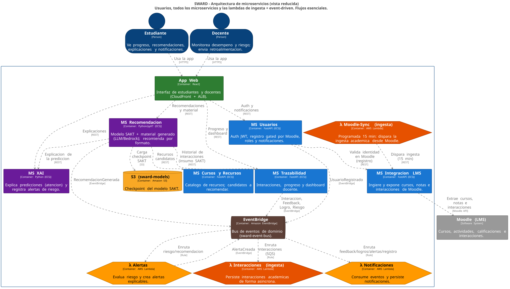{ width="520" }
<figcaption>C4 · vista de contenedores reducida — fuente:
<a href="diagramas/SWARD_C4_componentes_shortpaper.dsl"><code>SWARD_C4_componentes_shortpaper.dsl</code></a></figcaption>
</figure>

### Vista de contenedores — completa

La versión extensa con todos los elementos y relaciones, para la memoria de tesis.

<figure markdown>
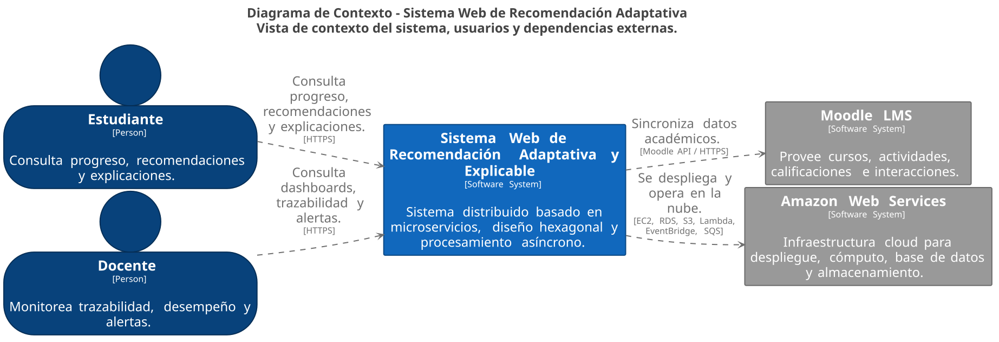{ width="760" }
<figcaption>C4 · vista completa — fuente:
<a href="diagramas/SWARD_C4_completo.dsl"><code>SWARD_C4_completo.dsl</code></a></figcaption>
</figure>

---

## Integración con Moodle (flujo de ingesta)

`EventBridge schedule → λ moodle-sync → ms-integracion-lms → Moodle REST → PostgreSQL → EventBridge → SAKT`.

<figure markdown>
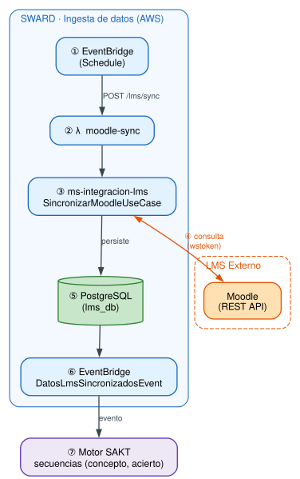{ width="420" }
<figcaption>Pipeline de ingesta de datos académicos desde Moodle.</figcaption>
</figure>

## Flujo de la librería pyKT

Dataset crudo → preprocesamiento → split K-Fold → modelo KT (DKT/SAKT) → entrenamiento → evaluación.

<figure markdown>
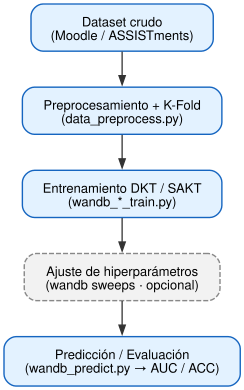{ width="680" }
<figcaption>Pipeline de entrenamiento/evaluación con pyKT.</figcaption>
</figure>

---

## Diagramas de clases (UML) — arquitectura hexagonal

Un diagrama de clases por microservicio, estructurado por las capas de la **arquitectura hexagonal**
(`domain` · `application` · `ports` · `infrastructure/adapters {in_, out_}`). El C4 muestra la
arquitectura **entre** servicios; estos muestran las clases **dentro** de cada uno.

=== "MS Usuarios"
    <figure markdown>
    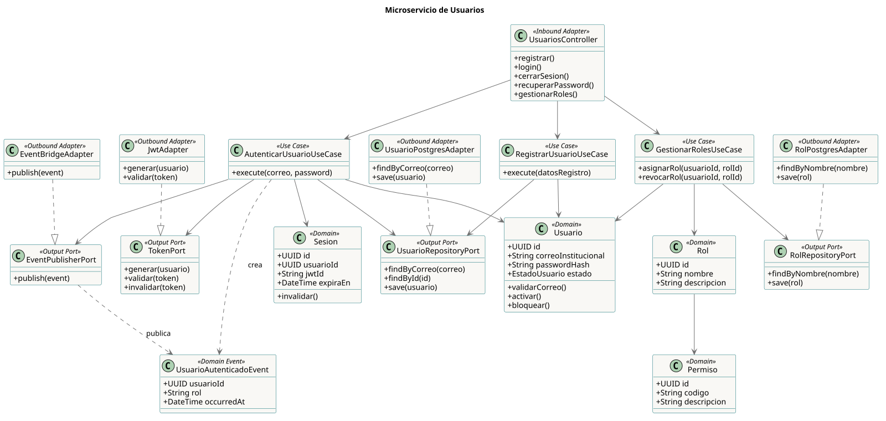
    <figcaption>Auth JWT, registro gated por Moodle, roles y notificaciones.</figcaption>
    </figure>

=== "MS Integración LMS"
    <figure markdown>
    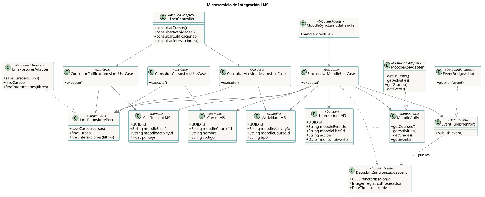
    <figcaption>Sincronización con Moodle (cursos, notas, interacciones).</figcaption>
    </figure>

=== "MS Cursos y Recursos"
    <figure markdown>
    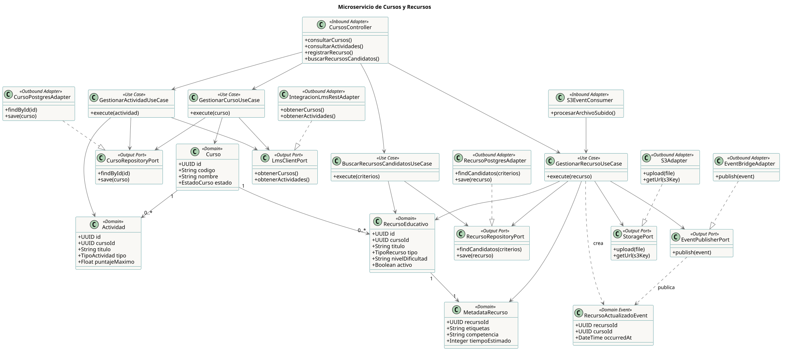
    <figcaption>Catálogo de cursos y recursos; candidatos a recomendar.</figcaption>
    </figure>

=== "MS Trazabilidad"
    <figure markdown>
    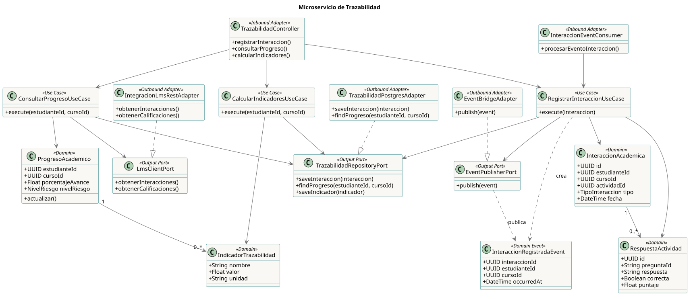
    <figcaption>Interacciones, progreso y dashboard docente.</figcaption>
    </figure>

=== "MS Recomendación"
    <figure markdown>
    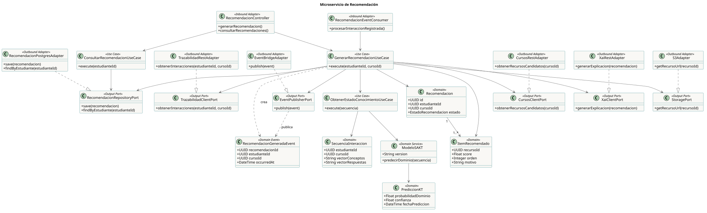
    <figcaption>Modelo SAKT + material generado (LLM/Bedrock).</figcaption>
    </figure>

=== "MS XAI"
    <figure markdown>
    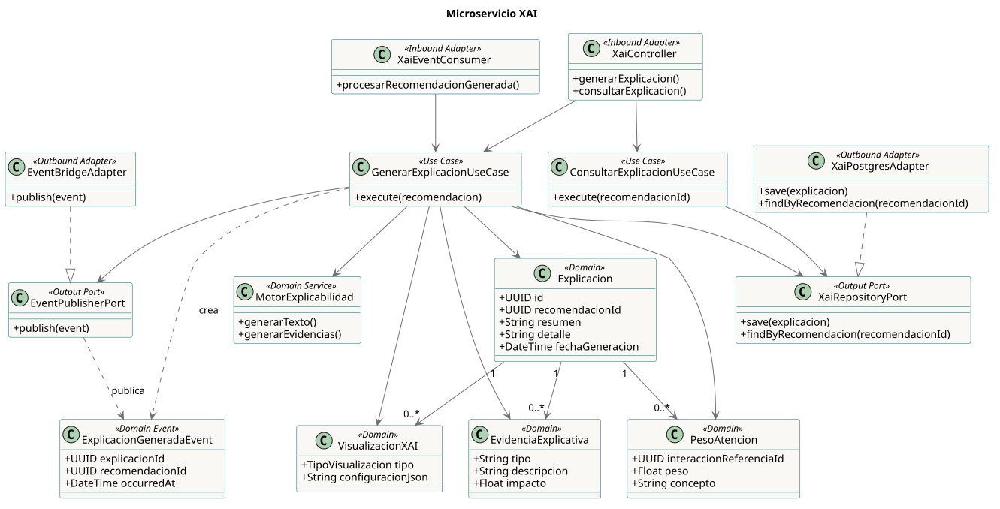
    <figcaption>Explicaciones (atención) y alertas de riesgo.</figcaption>
    </figure>

### Procesamiento asíncrono (event-driven)

<figure markdown>
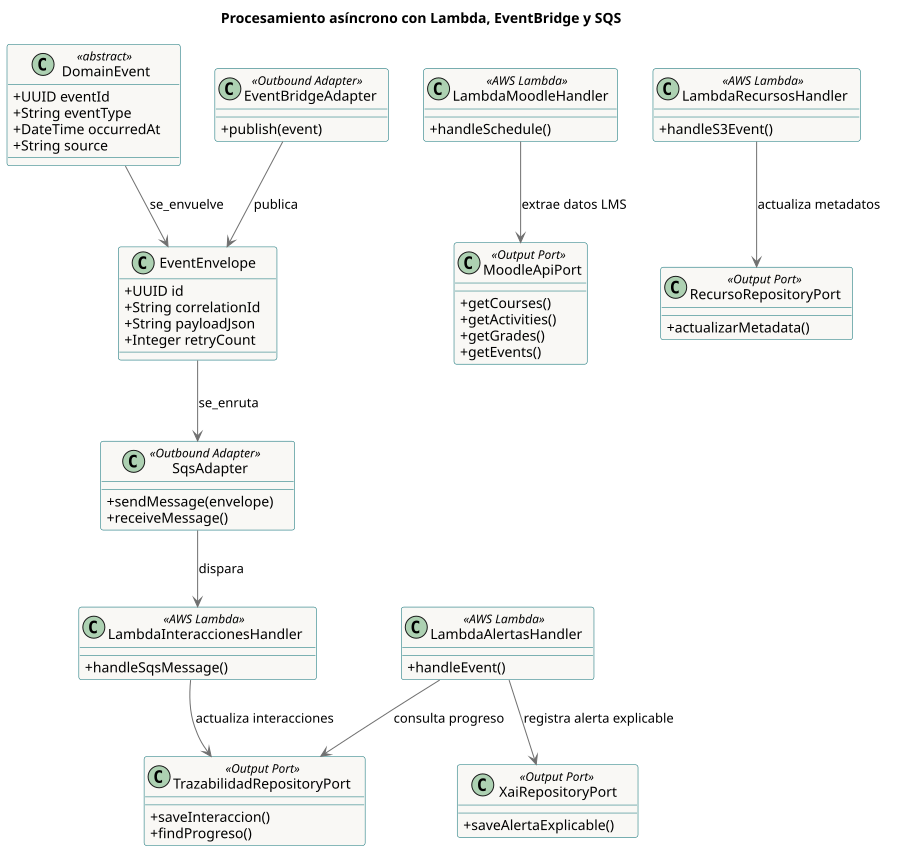{ width="700" }
<figcaption>Lambdas + EventBridge + SQS: ingesta y reacción a eventos de dominio.</figcaption>
</figure>

### Vista general del patrón hexagonal

<figure markdown>
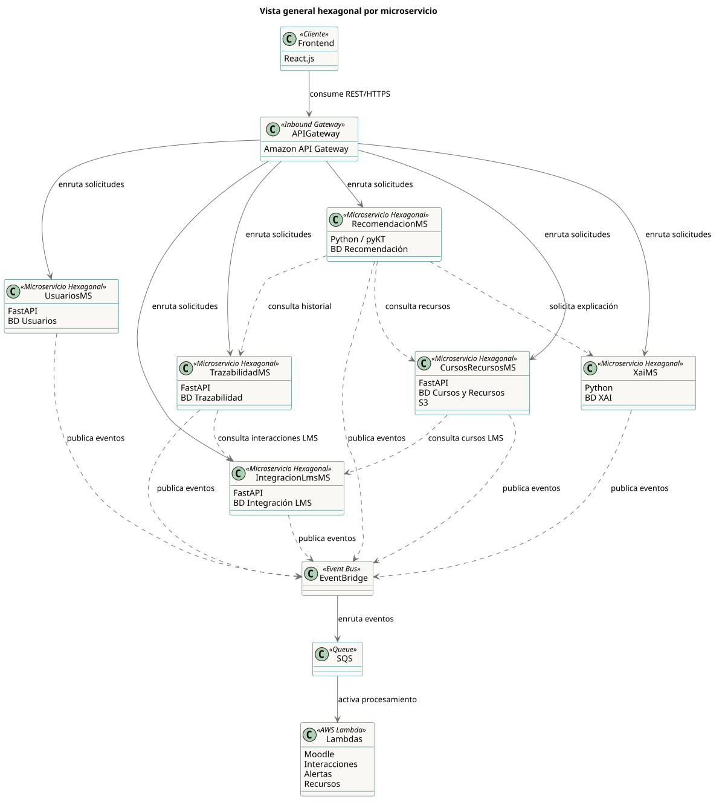{ width="640" }
<figcaption>Capas y dependencias del patrón Ports &amp; Adapters aplicado a cada microservicio.</figcaption>
</figure>

??? note "Fuentes PlantUML y cómo regenerar"
    Las fuentes `.puml` editables están en
    [`docs/diagramas/plantuml/`](https://github.com/sward-UPC/sward-docs/tree/main/docs/diagramas/plantuml)
    (una por microservicio + el flujo async + la vista general + una versión combinada).

    === "VS Code"
        Extensión *PlantUML* (jebbs) → abrir el `.puml` → `Alt+D` (preview) o exportar a SVG/PNG.
    === "Sin instalar nada"
        Pegar el contenido en <https://www.plantuml.com/plantuml> y descargar SVG/PNG.
    === "CLI / Kroki"
        ```bash
        # PlantUML local (requiere Java)
        plantuml -tsvg docs/diagramas/plantuml/*.puml
        # o vía Kroki (POST con User-Agent de navegador)
        curl -s -H "User-Agent: Mozilla/5.0" --data-binary @diagrama.puml \
          https://kroki.io/plantuml/svg -o diagrama.svg
        ```

??? note "Cómo renderizar el C4 (Structurizr)"
    === "Structurizr Lite (interactivo)"
        ```bash
        # desde docs/diagramas/, abre http://localhost:8080
        docker run -it --rm -p 8080:8080 -v "$PWD":/usr/local/structurizr structurizr/lite
        ln -sf SWARD_C4_componentes_shortpaper.dsl workspace.dsl   # Lite busca workspace.dsl
        ```
    === "CLI / Kroki"
        ```bash
        structurizr-cli export -workspace SWARD_C4_completo.dsl -format svg
        # o Kroki:
        curl -s -H "User-Agent: Mozilla/5.0" --data-binary @SWARD_C4_completo.dsl \
          https://kroki.io/structurizr/svg -o c4.svg
        ```

---

## Pseudocódigo del DKT y figuras para el paper

El pseudocódigo del **DKT** (con la versión LaTeX para Overleaf y el flujo pyKT en Mermaid/TikZ)
está en la página [**Pseudocódigo DKT**](diagramas-dkt.md), listo para el *short paper*.
