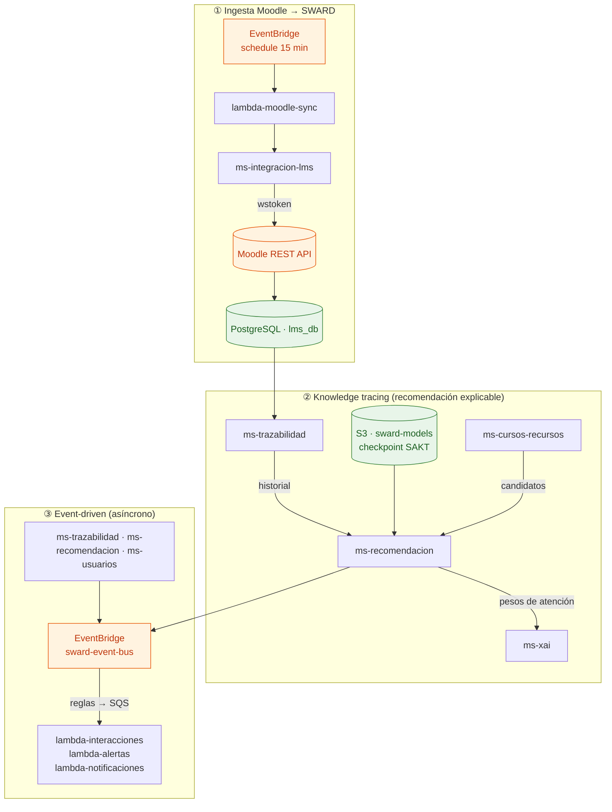

# SWARD · Documentación

**SWARD** (*Sistema Web de Recomendación Adaptativa y Explicable*) es un **tutor adaptativo**
construido sobre **Moodle** (LMS externo). A partir de las interacciones académicas reales de cada
estudiante, un modelo de **knowledge tracing** ([SAKT](https://arxiv.org/abs/1907.06837),
*Self-Attentive Knowledge Tracing*, entrenado con [pyKT](https://pykt-toolkit.readthedocs.io))
estima qué conceptos domina y cuáles no, y con esa estimación **recomienda el siguiente recurso**
(lectura, video, ejercicio) en el formato que mejor le funciona al alumno.

Las recomendaciones y las alertas de riesgo son **explicables** (XAI): se exponen los pesos de
atención del modelo para justificar *por qué* se sugiere algo o *por qué* se considera a un
estudiante en riesgo.

La plataforma está implementada como un conjunto de **microservicios con arquitectura hexagonal
(puertos y adaptadores) + DDD**, comunicados de forma **event-driven** sobre **AWS** (ECS Fargate,
Lambda, EventBridge, RDS PostgreSQL, Redis, S3, CloudFront + ALB). El frontend es una **SPA de
React** desplegada en GitHub Pages.

---

## Explora la documentación

- **[Arquitectura](arquitectura.md)** — Los 6 microservicios, las 5 lambdas, la plataforma AWS y los
  3 flujos principales (ingesta, knowledge tracing, event-driven).
- **[Operaciones](operaciones.md)** — Cómo **prender** y **apagar** la infraestructura para ahorrar
  costos, el stop nocturno automático y el modo dev.
- **[Secrets Runbook](secrets-runbook.md)** — Reconfigurar los GitHub secrets tras reconstruir la
  infra: qué va en qué repo, cuáles se regeneran y cómo obtener cada valor.
- **[Diagramas](diagramas.md)** — C4 (Structurizr), clases UML hexagonales por microservicio,
  integración Moodle y flujo pyKT, con el pseudocódigo del DKT.

---

## Arquitectura en un vistazo

Los **tres flujos** que articulan el sistema: la **ingesta** trae datos reales de Moodle, el
**knowledge tracing** los convierte en recomendaciones explicables, y el plano **event-driven**
desacopla los efectos secundarios (persistencia, alertas, notificaciones).

:::tip ¿De dónde sale esta vista?
Es el resumen de los tres ejes narrativos del modelo **C4** del proyecto. El diagrama C4
completo (Structurizr) y el resto de figuras están en la sección
[Diagramas](diagramas.md).
:::

---

## Glosario rápido

| Término | Significado |
|---------|-------------|
| **SWARD** | Sistema Web de Recomendación Adaptativa y Explicable. |
| **Knowledge Tracing (KT)** | Modelar el estado de conocimiento del estudiante a partir de su secuencia de respuestas. |
| **SAKT** | *Self-Attentive Knowledge Tracing*: modelo de KT basado en auto-atención (Transformer). |
| **pyKT** | Framework de *benchmarking* reproducible de modelos de KT; entrena y evalúa SAKT. |
| **XAI** | *Explainable AI*: explicaciones del modelo (en SWARD, los pesos de atención del SAKT). |
| **LMS** | *Learning Management System*; aquí, **Moodle** como sistema externo. |
| **Hexagonal** | Arquitectura de puertos y adaptadores: el dominio no conoce frameworks ni infraestructura. |
| **Event-driven** | Los servicios publican eventos de dominio en EventBridge; las lambdas reaccionan. |

---

## Organización (GitHub)

Todo el código vive en la organización **`sward-UPC`**, con un repositorio por componente
(`sward-ms-*`, `sward-lambda-*`, `sward-infra`, `sward-frontend`, `sward-model-training`,
`sward-shared`). Este repositorio (`sward-docs`) es la **documentación central transversal**.
